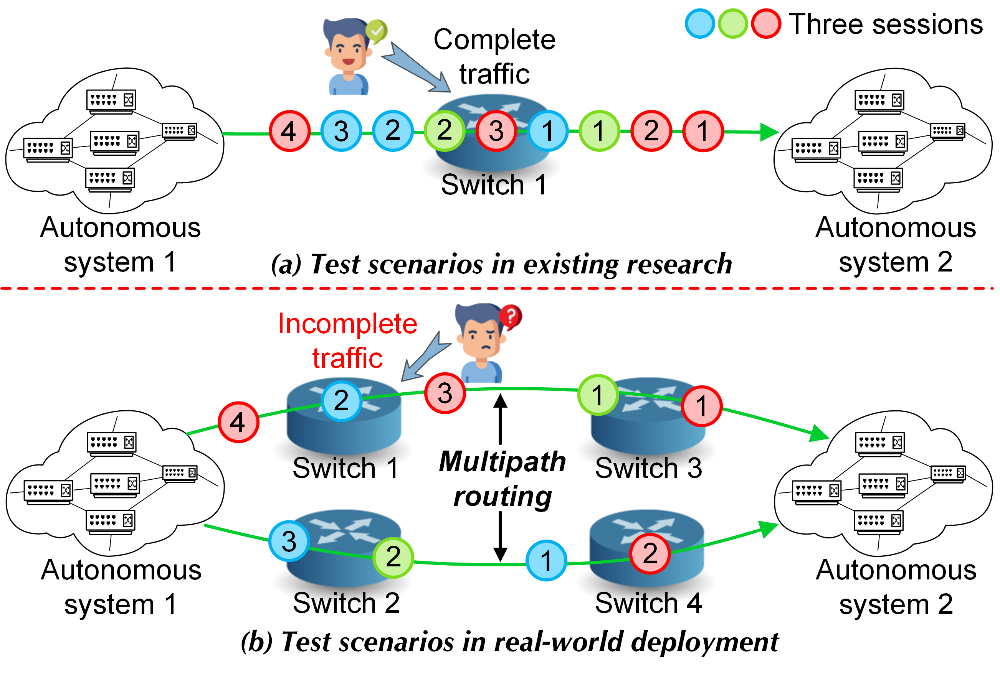
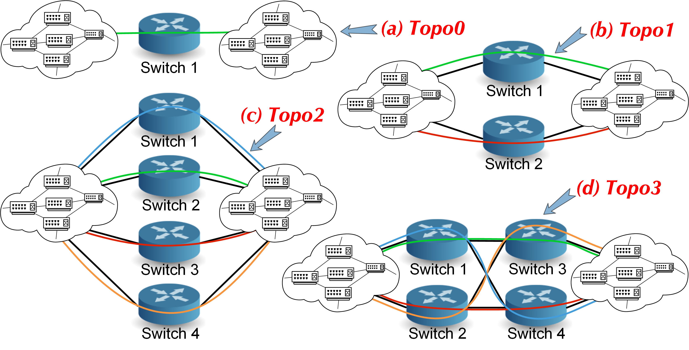

### TraRTP: A Robustness Test Platform for In-Network ML-Based Traffic Analysis Models against Multipath Routing

TraRTP is a platform to test the robustness of in-network traffic analysis models against the multipath routing phenomenon. Network management and security practitioners can use TraRTP to assess their traffic analysis model development and deployment. We configured four different topologies for TraRTP in this repository. 



## Multipath routing 

The switch implemented will use two tables to randomly forward packets to different destination hosts. The first table will use a hash function (applied to a 5-tuple consisting of the source and destination IP addresses, IP protocol, and source and destination TCP ports) to select one of the different destinations. The second table will use the computed hash value to forward the packet to the selected destination. 



## Run the code

1. In your shell, run:
   ```bash
   make
   ```   
   This will:
   * compile `load_balance.p4`, and
   * start a Mininet instance with several switches configured
     in a triangle, each connected to two host (`h1`, `h2`, `h3`).
   * The hosts are assigned IPs of `10.0.1.1`, `10.0.2.2`.  

2. You should now see a Mininet command prompt.  Open three terminals
   for `h1`, respectively:
   ```bash
   mininet> xterm h1 
   ```   

4. In `h1`'s XTerm, send a message from the client:
   ```bash
   tcpreplay -i eth0 Benign.pcap
   ```
5. Type `exit` to leave each XTerm and the Mininet command line.


## About the control plane

The control plane logic has already been implemented.  As part of bringing up the Mininet instance, the `make` script will install packet-processing rules in the tables of each switch. These are defined in the `sX-runtime.json` files.
